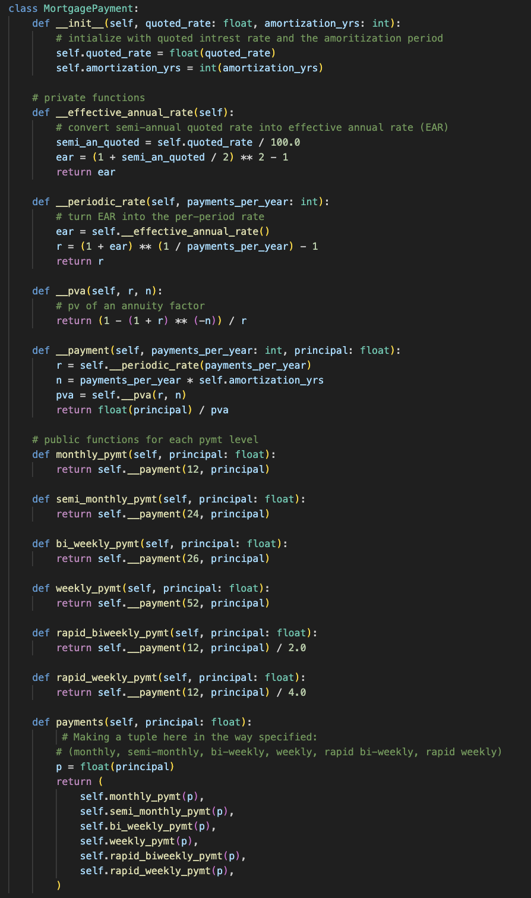
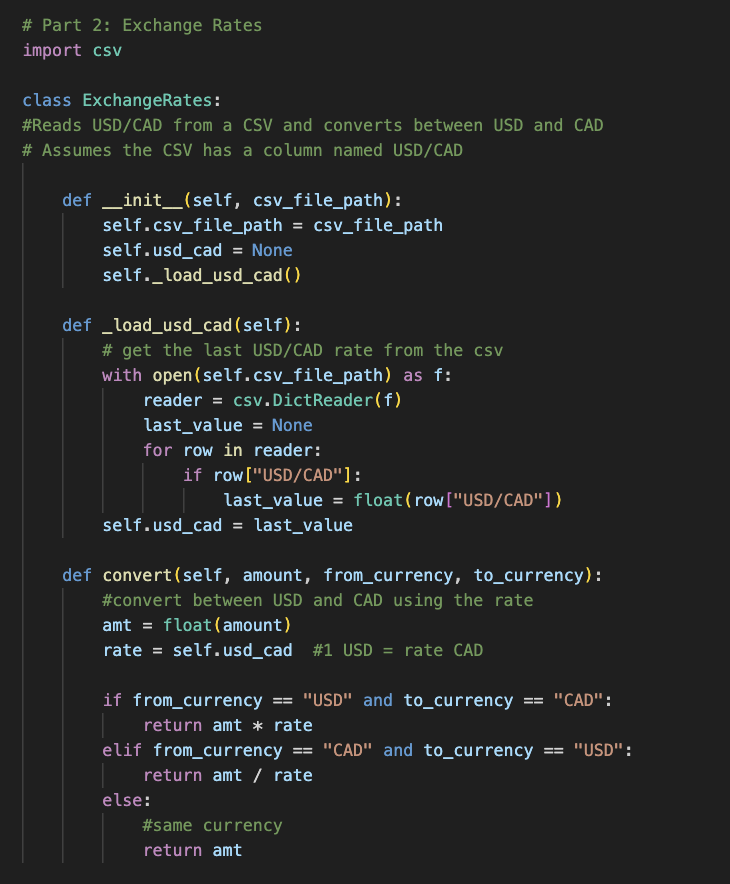
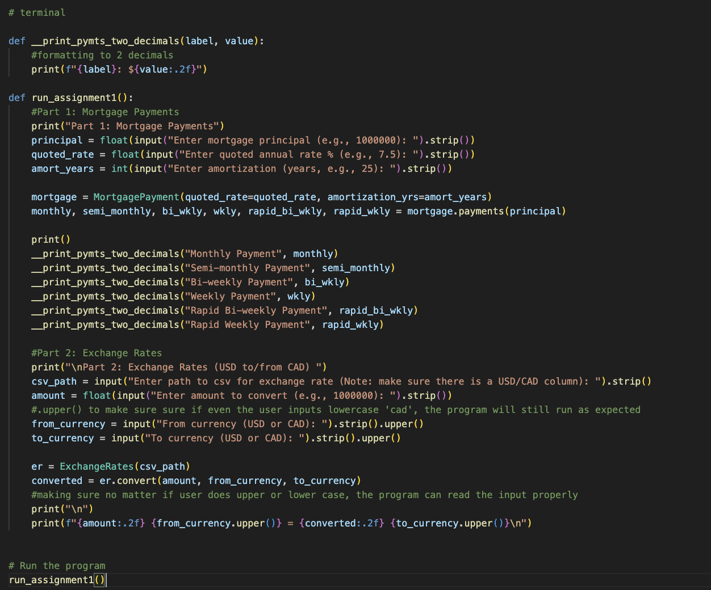

# FINE3300-2025-A1
## Adam Jaffar's Assignment #1
### Mortgage Payments Calculator + CAD/USD Exchange Rate Converter

In this assignment, we tackle creating:

1.  A Mortgage Payments class
2. A Exchange Rate class
3. Running the Program 
 
    
>The first part of the project focuses on Canadian fixed-rate mortgages, which are quoted as semi-annually compounded rates. Using the Present Value of Annuity (PVA) formula, the class computes different payment frequencies for a mortgage loan

>The second part of the assignment works with exchange rate data from a CSV file. The class reads the most recent USD/CAD value from the file and allows conversions between:
>>	CAD/USD
>
>>USD/CAD
>
>The program prompts the user for an amount and chosen currencies, then displays the converted result.

> The third part combines both classes into one program. It first calculates mortgate payments based on the users inputs, then performs currency conversion with the provided exchange rate info. Then the results are printed neatly.
## MortgagePayment Class
>>- Monthly
>>- Semi-Monthly
>>- Bi-Weekly
>>- Weekly
>>- Rapid Bi-Weekly
>>- Rapid Weekly

    A look into the MortgagePayment class

## Exchange Rate Class
    A look into the ExchangeRates class

## Running the program
  
